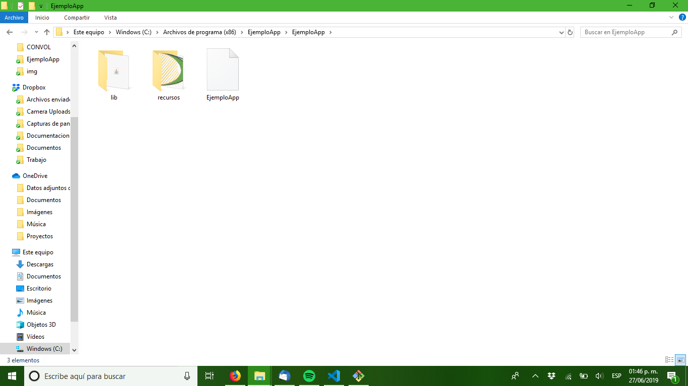
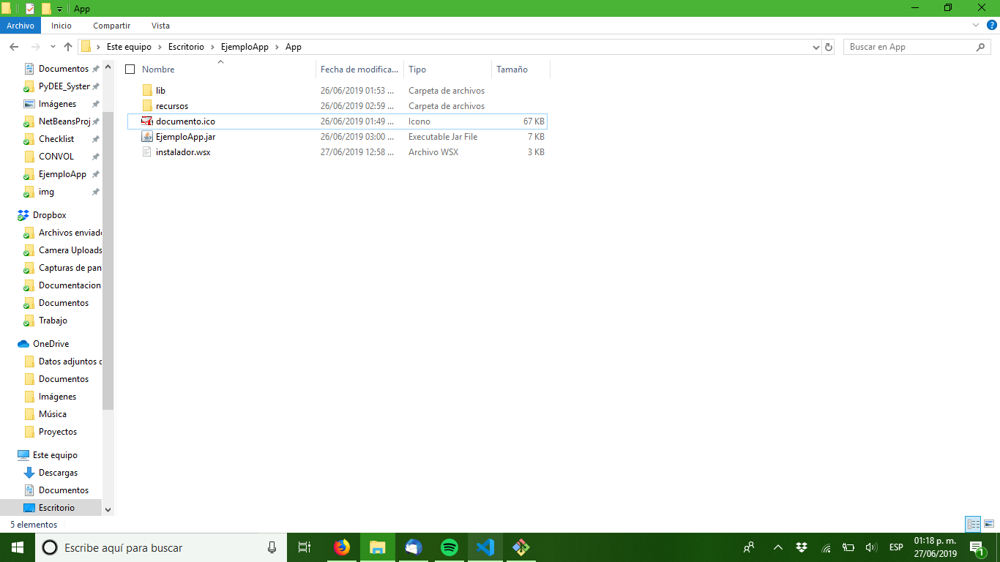
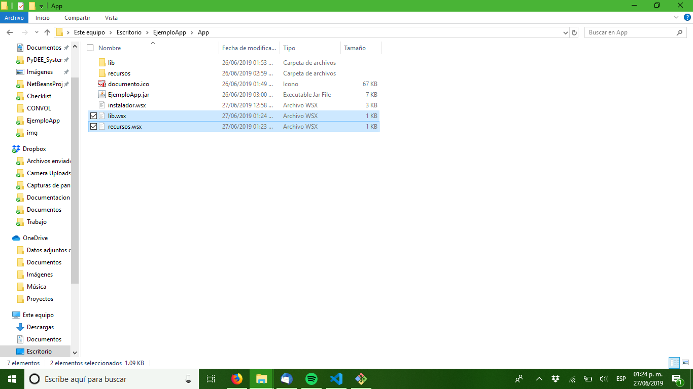
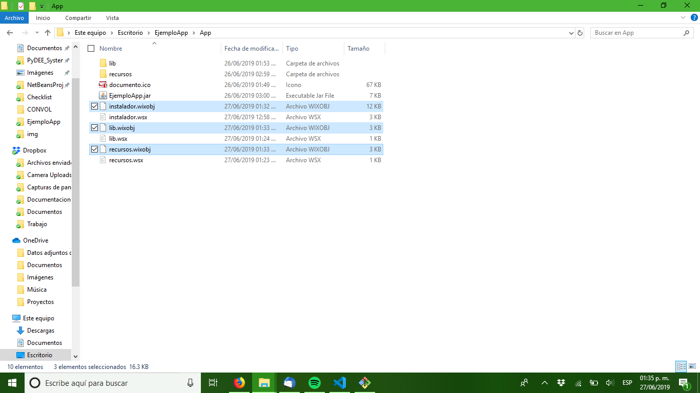
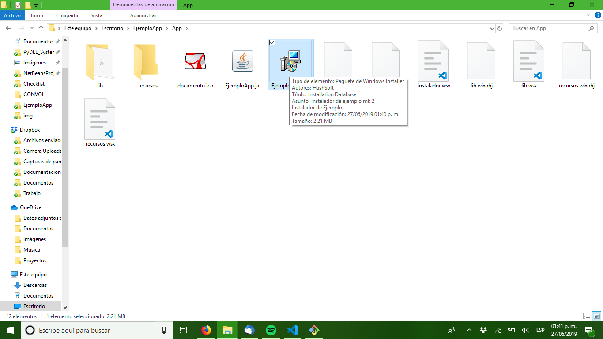
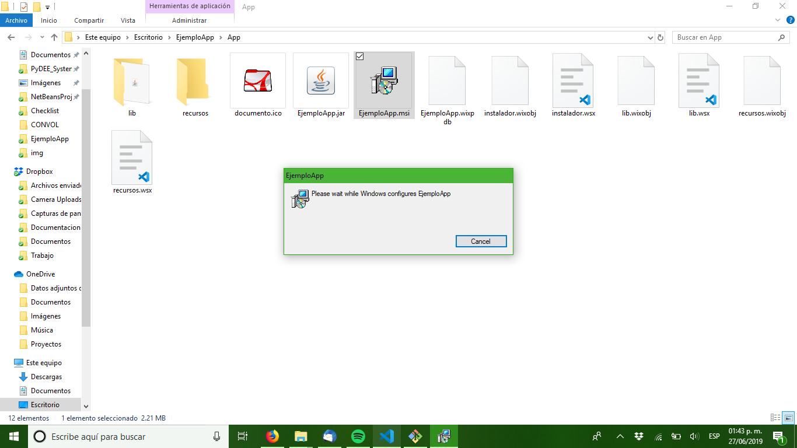

# Instalar varios archivos con Wix Toolset



Al momento de preparar el instalador de su aplicación para ser puesta en un entorno productivo es muy posible que llege a la conclusión de que necesita o que seria conveniente tener los archivos, librerias y/o recursos de su aplicación en carpetas separadas dentro de la carpeta de instalación, usualmente para flexibilidad con logotipos en reporte, librerias que requieren estar separadas por seguridad o configuración interna que necesite modificar ya en producción, cualquiera que sea el caso Wix Toolset permite generar un instalador que haga precisamente eso con muy ligeros cambios a como seria instalar un unico ejecutable.

Antes de continuar le recomiendo revisar una entrada anterior donde se describio como funciona Wix Toolset, todo lo dicho ahí vendra a la mano.

## Heat.exe
Para instalar mas de un archivo con Wix Toolset necesita declarar cada uno de esos archivos, junto con sus GUID en el archivo WSX en elementos <Component> y <File>, esto suena facil pero si su aplicación tiene varias imagenes o librerias esto de inmediato se vuelve impractivo, pero no se preocupe Wix Toolset incluye una herramienta para facilitar eso, heat.

Esta herramienta toma un directorio y genera un WSX que contiene todos los archivos con sus GUIDs generados y demas información necesaria de modo que con solo enlazar ese archivo a su WSX los archivos se incluyen en su instalador y se colocan en la ubicación adecuada.

La forma de usar el comando es la siguiente:

```
heat dir <DIRECTORIO> -o <SALIDA.wsx> -scom -frag -srd -sreg -gg -cg <ID GRUPO> -dr <REFERENCIA DIRECTORIO> -var var.SourceDir
```

Lo que vea en corchetes es los datos que debe ingresar, veamos que es cada uno
* DIRECTORIO - El directorio de donde queremos sacar los componentes
* SALIDA.wsx - El archivo WSX donde se almacenara el resultado
* ID GRUPO - El identificador de este grupo de componentes, asegurece de no repetirlo entre los archivos para el mismo instalador
* REFERENCIA DIRECTORIO - el identificador de ese directorio, asegurece de no repetirlo entre los archivos para el mismo instalador
* -var var.SourceDir - Esto lo usaremos despues para especificar el directorio cuando compilemos el instalador con candle

Cuando corra el comando con llenando los datos indicador obtendra un archivo wsx como el siguiente:

```xml
<?xml version="1.0" encoding="utf-8"?>
<Wix xmlns="http://schemas.microsoft.com/wix/2006/wi">
    <Fragment>
        <DirectoryRef Id="RECURSOS" />
    </Fragment>
    <Fragment>
        <ComponentGroup Id="GRUPO_RECURSOS">
            <Component Id="cmpCAA0B0E08770EA5447F765FB46835460" Directory="RECURSOS" Guid="{3A776C9C-5DE2-4A67-BCD2-BD7CA3897999}">
                <File Id="filD227683DA314642C803659BDF6C399D1" KeyPath="yes" Source="$(var.SourceDir)\logo.png" />
            </Component>
        </ComponentGroup>
    </Fragment>
</Wix>
```
En este ejemplo el directorio recursos solo contiene un archivo logo.png y como puede ver el GUID de cada componente y archivo se genero automaticamente, si la carpeta ubiera contenido mil archivos igual los incluiria todos, ahorrandole el trabajo de agregar cada componente a mano.

## Enlazar los archivos WSX
Ya que generó los archivos wsx para sus directorios ahora necesita enlazarlos al archivo wsx principal (el que contiene la información de la aplicación) esto es muy sencillo, literalmente es agregar dos lineas al wsx por cada archivo que tenga, primero vaya al elemento Directory donde esta el ejecutable principal y agrege un elemento Directory como el que se ve a continuación por cada archivo wsx que generó con heat.

```xml
<Directory Id="ID DEL DIRECTORIO" Name="NOMBRE DIRECTORIO">
</Directory>
```

Donde ID DEL DIRECTORIO es el Id de DirectoryRef en el wsx del directorio, que paso como argumento despues del -dr en el comando heat y Name es el nombre del directorio en si

Hecho eso vaya al elemento Feature y agrege una linea con el siguiente formato por cada archivo wsx que generara con heat.

```xml
<ComponentGroupRef Id="ID GRUPO COMPONENTES" />
```

Donde ID GRUPO COMPONENTES es el Id del elemento ComponentGroup del archivo wsx, el que paso como argumento despues de -cg en el comando heat.

El resultado se vera asi:

```xml
<?xml version="1.0" encoding="UTF-8"?>
<Wix xmlns="http://schemas.microsoft.com/wix/2006/wi">
  <!-- Datos del programa a instalar -->
  <Product Name="EjemploApp" Manufacturer="HashSoft" Id="3FBC216F-C2EE-42EC-9F67-702F1E6743BD" UpgradeCode="3FBC216F-C2EE-42EC-9F67-702F1E6743BD" Language="1033" Codepage="1252" Version="1.0.0">
    <!-- Detalles sobre el instalador -->
    <Package Id="*" Keywords="Installer" Description="Instalador de ejemplo mk 2" Comments="Instalador de Ejemplo" Manufacturer="HashSoft" InstallerVersion="100" Languages="1033" Compressed="yes" SummaryCodepage="1252" />
    <!-- Crea el medio de instalación y aplica compresion-->
    <Media Id="1" Cabinet="Sample.cab" EmbedCab="yes" />
    <Directory Id="TARGETDIR" Name="SourceDir">
      <Directory Id="ProgramFilesFolder" Name="PFiles">
        <Directory Id="ID_EJEMPLOAPP" Name="EjemploApp">
          <Directory Id="INSTALLDIR" Name="EjemploApp">
            <Component Id="MainExecutable" Guid="3FBC216F-C2EE-42EC-9F67-702F1E6743BD">
              <File Id="id_ejemploApp" Name="EjemploApp" DiskId="1" Source="EjemploApp.jar" KeyPath="yes">
                <Shortcut Id="startmenuFoobar10" Directory="ProgramMenuDir" Name="EjemploApp" WorkingDirectory="INSTALLDIR" Icon="IconoApp.exe" IconIndex="0" Advertise="yes" />
                <Shortcut Id="AccesoDirecto" Directory="DesktopFolder" Name="EjemploApp" WorkingDirectory="INSTALLDIR" Icon="IconoApp.exe" IconIndex="0" Advertise="yes" />
              </File>
            </Component>
            <!-- ESto crea y enlaza el contenido de la carpeta Archivos-->
            <Directory Id="RECURSOS" Name="recursos">
            </Directory>

            <!-- ESto crea y enlaza el contenido de la carpeta lib-->
            <Directory Id="LIBS" Name="lib">
            </Directory>

          </Directory>
        </Directory>
      </Directory>
      <Directory Id="ProgramMenuFolder" Name="Programs">
        <Directory Id="ProgramMenuDir" Name="EjemploApp">
          <Component Id="ProgramMenuDir" Guid="CFD27388-8A27-4EEC-9EF9-A9C58A96563F">
            <RemoveFolder Id="ProgramMenuDir" On="uninstall" />
            <RegistryValue Root="HKCU" Key="Software\[Manufacturer]\[ProductName]" Type="string" Value="" KeyPath="yes" />
          </Component>
        </Directory>
      </Directory>
      <Directory Id="DesktopFolder" Name="Desktop" />
    </Directory>
    <Feature Id="Complete" Level="1">
      <ComponentRef Id="MainExecutable" />
      <ComponentRef Id="ProgramMenuDir" />
      
      <!-- Con esto enlazamos al contenido de los archivos de los directorios-->
      <ComponentGroupRef Id="GRUPO_LIBS" />
      <ComponentGroupRef Id="GRUPO_RECURSOS" />
    </Feature>
    <!-- Definimos un icono -->
    <Icon Id="IconoApp.exe" SourceFile="documento.ico" />
    <!-- Icono que se mostrara en el panel de control -->
    <Property Id="ARPPRODUCTICON" Value="IconoApp.exe" />
  </Product>
</Wix>
```
Ya con esto los wsx estan listos para compilar con candle

## Compilando el WSX
Ahora que tenemos los archivos wsx (usualmente tendra uno por cada una de las carpetas a instalar) necesitamos compilarlos al formato wixobj con ayuda del comando candle.

El archivo wsx principal no tiene mayores complicaciones, solo ejecute el comando candle con ese archivo como argumento.

```
candle.exe instalador.wsx 
```

Y obtendra el archivo instalador.wixobj

Con los archivos que genero con el comando heat hay un argumento extra que debe agregar

```
candle.exe archvios_lib.wsx -dSourceDir="SourceDir\lib"
```

Notara el argumento -dSourceDir, lo que estamos haciedo con esto es indicarle al comando candle que donde vea SourceDir lo remplace con SourceDir\lib, esto es necesario para que el comando pueda localizar los archivos a incluir en el instalador.

Cuando compile los demas wsx debera cambiar SourceDir\lib a SourceDir\carpeta_con_los_archivos segun la carpeta que contenga los arvhivos indicados por el archivo wsx.

Hecho esto tendra los archivos .wixobj de cada uno de los archivos wsx.

## Creando el instalador.
Ahora que ya compilamos todos los archivos wsx es hora de crear nuestro instalador, para esto haremos uso del comando light.exe.

La forma de usar el comando light.exe es muy sencilla basta con pasarle de argumentos todos los archivos .wixobj que generamos en el paso anterior e indicarle con el comando -o el nombre que deseamos tenga nuestro instalador como puede ver a continuación.

```
light instalador.wixobj archivos_lib.wixobj  archivos_recursos.wixobj -o instalador.msi
```

Si todo sale bien el comando tomara unos momentos en procesar todo, no enviara mensajes de error y al terminar aparecera el archivo que indico despues del -o

Sin embargo hay dos errores que podrian aparecerle a continuación se describen junto con que hacer para corregirlos.

```
error LGHT0094 : Unresolved reference to symbol
```

Lo que este error significa es que en su archivo wsx principal escribio mal el Id del Directory o del ComponentGroupRef verifique en el archivo y linea que el error le indica y asegurece que en su archivo principal tenga los Id escritos exactamente igual.

```
error LGHT0103 : The system cannot find the file 
```

Este error indica que el comando light no pudo hallar el archivo indicado, la causa de esto suele ser que al compilar el archivo wsx con candle halla escrito mal el valor de -dSourceDir, para solucionarlo vuelva a compilar el archivo wsx que le indica el comando asegurandose que -dSourceDir tenga el valor correcto.

## Ejemplo
Ya que todo esto suena mas complicado de lo que es hagamos un pequeño ejemplo para que todo quede claro, comenzaremos con poniendo nuestro ejecutable, carpetas con librerias y recursos, icono y el archivo wix principal en una misma carpeta como se ve en la figura.



Abra el terminal y vaya a esa carpeta desde ahi generaremos los wsx para los directorios lib y recursos con los comandos:

```
heat dir recursos -o recursos.wsx -scom -frag -srd -sreg -gg -cg GRUPO_RECURSOS -dr RECURSOS -var var.SourceDir
heat dir lib -o lib.wsx -scom -frag -srd -sreg -gg -cg GRUPO_LIBS -dr LIBS -var var.SourceDir
```

lo que le generara los archivos recursos.wsx y lib.wsx como se observa en la figura.



Ahora debemos actualizar nuestro archivo wsx principal agregando los directorios y grupos de componentes exactamente como aparecen en los archivos wsx que generamos con el comando heat.

Tras esas modificaciones el archivo principal se ve así.

```xml
<?xml version="1.0" encoding="UTF-8"?>
<Wix xmlns="http://schemas.microsoft.com/wix/2006/wi">
  <!-- Datos del programa a instalar -->
  <Product Name="EjemploApp" Manufacturer="HashSoft" Id="3FBC216F-C2EE-42EC-9F67-702F1E6743BD" UpgradeCode="3FBC216F-C2EE-42EC-9F67-702F1E6743BD" Language="1033" Codepage="1252" Version="1.0.0">
    <!-- Detalles sobre el instalador -->
    <Package Id="*" Keywords="Installer" Description="Instalador de ejemplo mk 2" Comments="Instalador de Ejemplo" Manufacturer="HashSoft" InstallerVersion="100" Languages="1033" Compressed="yes" SummaryCodepage="1252" />
    <!-- Crea el medio de instalación y aplica compresion-->
    <Media Id="1" Cabinet="Sample.cab" EmbedCab="yes" />
    <Directory Id="TARGETDIR" Name="SourceDir">
      <Directory Id="ProgramFilesFolder" Name="PFiles">
        <Directory Id="ID_EJEMPLOAPP" Name="EjemploApp">
          <Directory Id="INSTALLDIR" Name="EjemploApp">
            <Component Id="MainExecutable" Guid="3FBC216F-C2EE-42EC-9F67-702F1E6743BD">
              <File Id="id_ejemploApp" Name="EjemploApp" DiskId="1" Source="EjemploApp.jar" KeyPath="yes">
                <Shortcut Id="startmenuFoobar10" Directory="ProgramMenuDir" Name="EjemploApp" WorkingDirectory="INSTALLDIR" Icon="IconoApp.exe" IconIndex="0" Advertise="yes" />
                <Shortcut Id="AccesoDirecto" Directory="DesktopFolder" Name="EjemploApp" WorkingDirectory="INSTALLDIR" Icon="IconoApp.exe" IconIndex="0" Advertise="yes" />
              </File>
            </Component>
            <!-- ESto crea y enlaza el contenido de la carpeta Archivos-->
            <Directory Id="RECURSOS" Name="recursos">
            </Directory>

            <!-- ESto crea y enlaza el contenido de la carpeta lib-->
            <Directory Id="LIBS" Name="lib">
            </Directory>

          </Directory>
        </Directory>
      </Directory>
      <Directory Id="ProgramMenuFolder" Name="Programs">
        <Directory Id="ProgramMenuDir" Name="EjemploApp">
          <Component Id="ProgramMenuDir" Guid="CFD27388-8A27-4EEC-9EF9-A9C58A96563F">
            <RemoveFolder Id="ProgramMenuDir" On="uninstall" />
            <RegistryValue Root="HKCU" Key="Software\[Manufacturer]\[ProductName]" Type="string" Value="" KeyPath="yes" />
          </Component>
        </Directory>
      </Directory>
      <Directory Id="DesktopFolder" Name="Desktop" />
    </Directory>
    <Feature Id="Complete" Level="1">
      <ComponentRef Id="MainExecutable" />
      <ComponentRef Id="ProgramMenuDir" />
      
      <!-- Con esto enlazamos al contenido de los archivos de los directorios-->
      <ComponentGroupRef Id="GRUPO_LIBS" />
      <ComponentGroupRef Id="GRUPO_RECURSOS" />
    </Feature>
    <!-- Definimos un icono -->
    <Icon Id="IconoApp.exe" SourceFile="documento.ico" />
    <!-- Icono que se mostrara en el panel de control -->
    <Property Id="ARPPRODUCTICON" Value="IconoApp.exe" />
  </Product>
</Wix>
```

Ahora compilamos los archivos wsx con los siguientes comandos.

```
candle instalador.wsx
candle lib.wsx -dSourceDir="SourceDir\lib"
candle recursos.wsx -dSourceDir="SourceDir\recursos"
```

Notara que ahota tiene tres archivos wixobj en la carpeta.



Ahora si creamos el instalador con el comando

```
light instalador.wixobj lib.wixobj recursos.wixobj -o EjemploApp.msi
```
Y listo tenemos nuestro instalador



¿Y funciona ?




Y si va a archivos de programa vera que las carpetas que declaro se crearon con el contenido esperado.


Espero que esta información le fuera de utilidad y nos vemos en la proxima entrada :).
